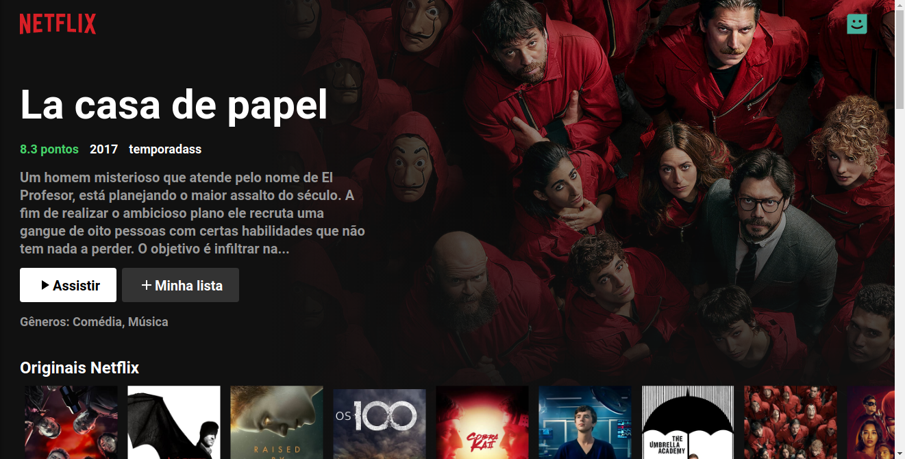
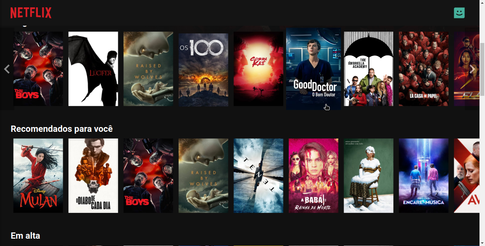

# 🎬 Netflix Clone com ReactJS

Clone de interface da Netflix seguindo tutorial da [B7Web](https://b7web.com.br/).





## Instalação e uso

- Clone o repositório e entre na pasta:

  ```sh
  $ git clone https://github.com/DarkTechLC/netflix-clone-reactjs.git

  $ cd netflix-clone-reactjs
  ```

- Instale os módulos:

  ```sh
  $ yarn install
  ```

- Vá até [The Movie DB](https://www.themoviedb.org/), realize o cadastro e obtenha a chave da API.

- Atribua a chave da API na variável `API_KEY` do arquivo `./src/Tmdb.js`.

- Execute o projeto:

  ```sh
  $ yarn start
  ```

- Vá para [http://127.0.0.1:3000](http://127.0.0.1:3000).

> Todos os direitos de imagem para Netflix.

> Dados obtidos do [The Movie DB](https://www.themoviedb.org/).
